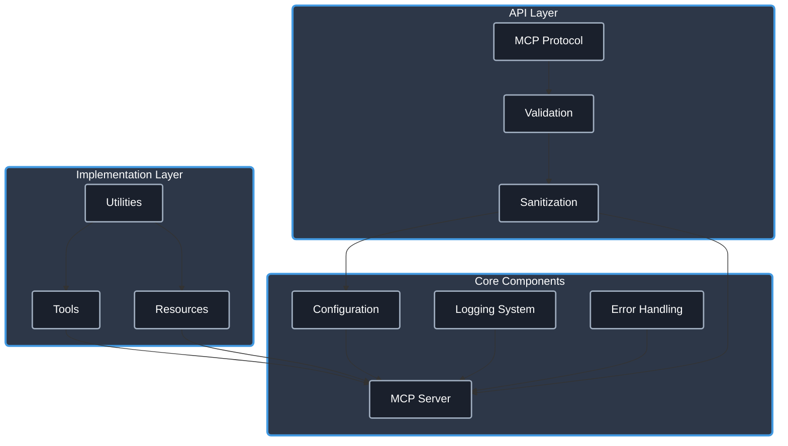

# MCP TypeScript Template

[](https://www.typescriptlang.org/)
[](https://modelcontextprotocol.io/)
[]()
[](https://opensource.org/licenses/Apache-2.0)
[](https://github.com/cyanheads/mcp-ts-template/issues)
[](https://github.com/cyanheads/mcp-ts-template)

A beginner-friendly foundation for building [Model Context Protocol (MCP)](https://modelcontextprotocol.io/) servers (and in the future also clients) with TypeScript. This template provides a comprehensive starting point with production-ready utilities, well-structured code, and working examples for building an MCP server.

Copy this repo to kickstart your own MCP server and set your **vibe code** session up for success!

## Using this template as your repo will get you:

- **Utilities**: A set of reusable utilities for logging, error handling, ID generation, rate limiting, and request context management.
- **Type Safety**: Strong typing with TypeScript to catch errors at compile time.
- **Security**: Built-in security features to protect against common vulnerabilities.
- **Error Handling**: A robust error handling system that categorizes and formats errors consistently.
- **Documentation**: Comprehensive documentation for tools and resources, including usage examples and implementation details.
- **Example Implementations**: Working examples of [echo_message (tool)](src/mcp-server/tools/echoTool/README.md) and [echo://hello (resource)](src/mcp-server/resources/echoResource/README.md) to help you get started quickly.

> **.clinerules**: This repository includes a [.clinerules](.clinerules) file that serves as a developer cheat sheet for your LLM coding agent with quick reference for the codebase patterns, file locations, and code snippets. When copying this template for your own project, be sure to update the cheat sheet to reflect your modifications and additions.

## Table of Contents

- [Overview](#overview)
  - [What is Model Context Protocol?](#what-is-model-context-protocol)
  - [Architecture & Components](#architecture--components)
- [Features](#features)
  - [Core Utilities](#core-utilities)
  - [Type Safety](#type-safety)
  - [Error Handling](#error-handling)
  - [Security](#security)
  - [Example Implementations](#example-implementations)
- [Installation](#installation)
- [Configuration](#configuration)
- [Project Structure](#project-structure)
- [Tool & Resource Documentation](#tool--resource-documentation)
  - [Tools](#tools)
  - [Resources](#resources)
- [Development Guidelines](#development-guidelines)
  - [Adding a New Tool](#adding-a-new-tool)
  - [Adding a New Resource](#adding-a-new-resource)
- [Future Plans](#future-plans)
- [License](#license)

## Overview

### What is Model Context Protocol?

Model Context Protocol (MCP) is a framework that enables AI systems to interact with external tools and resources. It allows language models to:

- Execute **tools** that perform actions and return results
- Access structured **resources** that provide information
- Create contextual workflows through standardized interfaces

This template gives you a head start in building MCP servers that can be used by AI systems to extend their capabilities.

### Architecture & Components

The template follows a modular architecture designed for clarity and extensibility:

<details>
<summary>Click to expand architecture diagram</summary>



</details>

Core Components:

- **Configuration System**: Environment-aware configuration with validation
- **Logging System**: Structured logging with sensitive data redaction
- **Error Handling**: Centralized error processing with consistent patterns
- **MCP Server**: Protocol implementation for tools and resources
- **Validation Layer**: Input validation using [Zod](https://github.com/colinhacks/zod) schemas
- **Utilities**: Reusable utility functions for common operations

## Features

### Core Utilities

- **[Logging](src/utils/README.md#-logger)**: Configurable logging with file rotation and sensitive data redaction
- **[Error Handling](src/utils/README.md#-error-handler)**: Pattern-based error classification and standardized reporting
- **[ID Generation](src/utils/README.md#-id-generator)**: Secure unique identifier creation with prefix support
- **[Rate Limiting](src/utils/README.md#-rate-limiter)**: Request throttling to prevent API abuse
- **[Request Context](src/utils/README.md#-request-context)**: Request tracking and correlation
- **[Sanitization](src/utils/README.md#-sanitization)**: Input validation and cleaning

### Type Safety

- **[Global Types](src/types-global/README.md)**: Shared type definitions for consistent interfaces
- **[Error Types](src/types-global/README.md#error-types)**: Standardized error codes and structures
- **[MCP Protocol Types](src/types-global/README.md#mcp-protocol-types)**: Type definitions for the MCP protocol
- **[Tool Types](src/types-global/README.md#tool-types)**: Interfaces for tool registration and configuration

### Error Handling

- **Pattern-Based Classification**: Automatically categorize errors based on message patterns
- **Consistent Formatting**: Standardized error responses with additional context
- **Error Mapping**: Custom error transformation for domain-specific errors
- **Safe Try/Catch Patterns**: Centralized error processing helpers

### Security

- **Input Validation**: Schema-based validation using Zod
- **Input Sanitization**: Protection against injection attacks
- **Parameter Bounds**: Enforced limits to prevent abuse
- **Sensitive Data Redaction**: Automatic redaction in logs

### Example Implementations

- **[Echo Tool](src/mcp-server/tools/echoTool/README.md)**: Complete example of a tool implementation
- **[Echo Resource](src/mcp-server/resources/echoResource/README.md)**: Complete example of a resource implementation
- **[Registration Helpers](src/mcp-server/utils/README.md)**: Utilities for consistent component registration

## Installation

### Prerequisites

- [Node.js (v18+)](https://nodejs.org/)
- [npm](https://www.npmjs.com/) or [yarn](https://yarnpkg.com/)

### Setup

1. Clone this repository:

   ```bash
   git clone https://github.com/cyanheads/mcp-ts-template.git
   cd mcp-ts-template
   ```

2. Install dependencies:

   ```bash
   npm install
   ```

3. Build the project:

   ```bash
   npm run build
   ```

4. Start the server:
   ```bash
   npm run start
   ```

## Configuration

### Environment Variables (Optional)

Create a `.env` file based on `.env.example`:

```bash
# Server Configuration
NODE_ENV=development # development, production
LOG_LEVEL=info # debug, info, warn, error

# Rate Limiting
RATE_LIMIT_WINDOW_MS=60000
RATE_LIMIT_MAX_REQUESTS=100
```

### Configuration System

The [configuration system](src/config/README.md) provides a flexible way to manage settings:

- **Environment Config**: Load settings from environment variables
- **MCP Servers Config**: Configure MCP server connections (for future client implementations)
- **Lazy Loading**: Configurations are loaded only when needed

## Project Structure

The codebase follows a modular structure:

```bash
src/
├── config/                 # Configuration management
│   ├── envConfig.ts        # Environment variable handling
│   ├── index.ts            # Unified configuration
│   └── mcpConfig.ts        # MCP server configuration
│
├── mcp-server/             # MCP server implementation
│   ├── resources/          # Resource implementations
│   │   └── echoResource/   # Example resource
│   ├── tools/              # Tool implementations
│   │   └── echoTool/       # Example tool
│   └── utils/              # Server utilities
│       └── registrationHelper.ts  # Registration helpers
│
├── types-global/           # Shared type definitions
│   ├── errors.ts           # Error types and codes
│   ├── mcp.ts              # MCP protocol types
│   └── tool.ts             # Tool registration types
│
├── utils/                  # Common utilities
│   ├── errorHandler.ts     # Error handling
│   ├── idGenerator.ts      # ID generation
│   ├── logger.ts           # Logging system
│   ├── rateLimiter.ts      # Rate limiting
│   ├── requestContext.ts   # Request context
│   ├── sanitization.ts     # Input sanitization
│   └── security.ts         # Security utilities
│
└── [index.ts](src/index.ts)                # Application entry point
.clinerules                 # Developer cheat sheet for LLM coding agent
```

## Tool & Resource Documentation

### Tools

| Tool          | Description                                                                                                                      |
| ------------- | -------------------------------------------------------------------------------------------------------------------------------- |
| **Echo Tool** | Formats and echoes messages with various options. Demonstrates input validation, error handling, and proper response formatting. |

See the [Echo Tool documentation](src/mcp-server/tools/echoTool/README.md) for detailed usage examples and implementation details.

### Resources

| Resource          | Description                                                                                                                            |
| ----------------- | -------------------------------------------------------------------------------------------------------------------------------------- |
| **Echo Resource** | Returns echo messages based on input parameters. Demonstrates resource registration, URI handling, and consistent response formatting. |

See the [Echo Resource documentation](src/mcp-server/resources/echoResource/README.md) for detailed usage examples and implementation details.

## Development Guidelines

### Adding a New Tool

1. Create a new directory under [`src/mcp-server/tools/`](src/mcp-server/tools/)
2. Define types and schemas in a `types.ts` file
3. Implement the handler in a dedicated file
4. Create an `index.ts` file that registers the tool
5. Add your tool to the server registration in [`src/mcp-server/server.ts`](src/mcp-server/server.ts)

Example tool registration:

```typescript
// In your tool's index.ts
export const registerMyTool = async (server: McpServer): Promise<void> => {
  return registerTool(server, { name: "my_tool" }, async (server, logger) => {
    server.tool(
      "my_tool",
      {
        /* input schema */
      },
      async (params) => {
        // Your implementation
      }
    );
  });
};

// In src/mcp-server/server.ts
await registerMyTool(mcpServer);
```

### Adding a New Resource

1. Create a new directory under [`src/mcp-server/resources/`](src/mcp-server/resources/)
2. Define types and schemas in a `types.ts` file
3. Implement the handler in a dedicated file
4. Create an `index.ts` file that registers the resource
5. Add your resource to the server registration in [`src/mcp-server/server.ts`](src/mcp-server/server.ts)

## Future Plans

This template serves as a foundation for:

- **MCP Client Implementation**: Support for creating MCP clients that connect to various AI models

## License

This project is licensed under the Apache License 2.0 - see the [LICENSE](LICENSE) file for details.

```
Copyright 2025 Casey Hand @cyanheads

Licensed under the Apache License, Version 2.0 (the "License");
you may not use this file except in compliance with the License.
You may obtain a copy of the License at

    http://www.apache.org/licenses/LICENSE-2.0

Unless required by applicable law or agreed to in writing, software
distributed under the License is distributed on an "AS IS" BASIS,
WITHOUT WARRANTIES OR CONDITIONS OF ANY KIND, either express or implied.
See the License for the specific language governing permissions and
limitations under the License.
```

---

<div align="center">
Built with the <a href="https://modelcontextprotocol.io/">Model Context Protocol</a>
</div>
