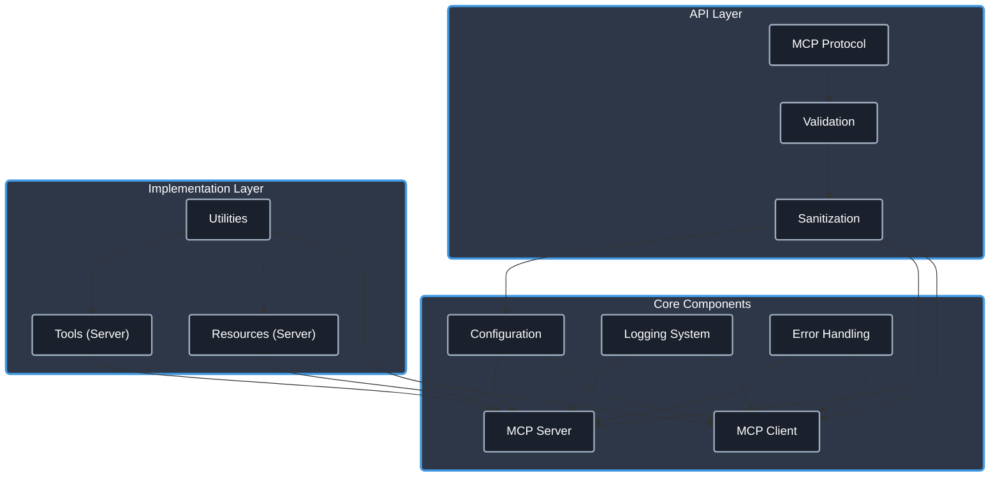

# MCP TypeScript Template

[](https://www.typescriptlang.org/)
[](https://modelcontextprotocol.io/)
[](./CHANGELOG.md) <!-- Link to Changelog -->
[](https://opensource.org/licenses/Apache-2.0)
[](https://github.com/cyanheads/mcp-ts-template/issues)
[](https://github.com/cyanheads/mcp-ts-template)

A beginner-friendly foundation for building [Model Context Protocol (MCP)](https://modelcontextprotocol.io/) servers and clients with TypeScript. This template provides a comprehensive starting point with production-ready utilities, well-structured code, and working examples for both server and client implementations.

Copy this repo to kickstart your own MCP server or integrate MCP client capabilities into your application!

## Using this template as your repo will get you:

- **Utilities**: A set of reusable utilities for logging, error handling, ID generation, rate limiting, and request context management.
- **Type Safety**: Strong typing with TypeScript to catch errors at compile time.
- **Security**: Built-in security features to protect against common vulnerabilities.
- **Error Handling**: A robust error handling system that categorizes and formats errors consistently.
- **Documentation**: Comprehensive documentation for tools and resources, including usage examples and implementation details.
- **Example Implementations**: Working examples of [echo_message (tool)](src/mcp-server/tools/echoTool/) and [echo://hello (resource)](src/mcp-server/resources/echoResource/) for the server, and a functional client setup.
- **MCP Client**: A robust client implementation ([src/mcp-client/](src/mcp-client/)) for connecting to and interacting with MCP servers defined in a configuration file.

> **.clinerules**: This repository includes a [.clinerules](.clinerules) file that serves as a developer cheat sheet for your LLM coding agent with quick reference for the codebase patterns, file locations, and code snippets. When copying this template for your own project, be sure to update the cheat sheet to reflect your modifications and additions.

## Table of Contents

- [Overview](#overview)
  - [What is Model Context Protocol?](#what-is-model-context-protocol)
  - [Architecture & Components](#architecture--components)
- [Features](#features)
  - [Core Utilities](#core-utilities)
  - [Type Safety](#type-safety)
  - [Error Handling](#error-handling)
  - [Security](#security)
  - [Example Implementations](#example-implementations)
  - [MCP Client Implementation](#mcp-client-implementation)
- [Installation](#installation)
- [Configuration](#configuration)
  - [Server Configuration](#server-configuration)
  - [Client Configuration](#client-configuration)
- [Project Structure](#project-structure)
- [Tool & Resource Documentation](#tool--resource-documentation)
  - [Tools](#tools)
  - [Resources](#resources)
- [Development Guidelines](#development-guidelines)
  - [Adding a New Tool](#adding-a-new-tool)
  - [Adding a New Resource](#adding-a-new-resource)
- [Future Plans](#future-plans)
- [License](#license)

## Overview

### What is Model Context Protocol?

Model Context Protocol (MCP) is a framework that enables AI systems to interact with external tools and resources. It allows language models to:

- Execute **tools** that perform actions and return results
- Access structured **resources** that provide information
- Create contextual workflows through standardized interfaces

This template gives you a head start in building MCP servers that can be used by AI systems to extend their capabilities, and provides a client implementation for connecting to other MCP servers.

### Architecture & Components

The template follows a modular architecture designed for clarity and extensibility:

<details>
<summary>Click to expand architecture diagram</summary>



</details>

Core Components:

- **Configuration System**: Environment-aware configuration with validation for both server and client settings.
- **Logging System**: Structured logging with sensitive data redaction.
- **Error Handling**: Centralized error processing with consistent patterns.
- **MCP Server**: Protocol implementation supporting both `stdio` and `http` transports.
- **MCP Client**: Client implementation for connecting to MCP servers via `stdio` or `http`, managed through `mcp-config.json`.
- **HTTP Transport**: Express-based server using Server-Sent Events (SSE) for streaming, session management, and configurable CORS. Includes port conflict retry logic.
- **Validation Layer**: Input validation and sanitization using `validator`, `sanitize-html`, and `zod`.
- **Utilities**: Reusable utility functions for common operations.

## Explore More MCP Resources

For a broader collection of MCP guides, utilities, and diverse server implementations (including Perplexity, Atlas, Filesystem, Obsidian, Git, GitHub, Ntfy, and more), check out the companion repository:

➡️ **[cyanheads/model-context-protocol-resources](https://github.com/cyanheads/model-context-protocol-resources)**

This repository complements the template by providing in-depth guides and helpful resources based on my real-world usage and learning of MCP.

## Features

### Core Utilities

- **Logging**: Configurable logging with file rotation and sensitive data redaction.
- **Error Handling**: Pattern-based error classification and standardized reporting.
- **ID Generation**: Secure unique identifier creation with prefix support.
- **Rate Limiting**: Request throttling to prevent API abuse.
- **Request Context**: Request tracking and correlation across operations.
- **Sanitization**: Input validation and cleaning using `validator` and `sanitize-html`.

### Type Safety

- **Global Types**: Shared type definitions for consistent interfaces.
- **Error Types**: Standardized error codes and structures.
- **MCP Protocol Types**: Type definitions for the MCP protocol (leveraging `@modelcontextprotocol/sdk`).
- **Tool Types**: Interfaces for tool registration and configuration.
- **Zod Schemas**: Used for robust validation of configuration files and tool/resource inputs.

### Error Handling

- **Pattern-Based Classification**: Automatically categorize errors based on message patterns.
- **Consistent Formatting**: Standardized error responses with additional context.
- **Error Mapping**: Custom error transformation for domain-specific errors.
- **Safe Try/Catch Patterns**: Centralized error processing helpers (`ErrorHandler.tryCatch`).
- **Client/Transport Error Handling**: Specific handlers for MCP client and transport errors.

### Security

- **Input Validation**: Using `validator` and `zod` for various data type checks.
- **Input Sanitization**: Using `sanitize-html` to prevent injection attacks.
- **Parameter Bounds**: Enforced limits within sanitization logic to prevent abuse.
- **Sensitive Data Redaction**: Automatic redaction in logs.
- **Configuration Fallback**: Safely falls back to `mcp-config.json.example` if primary config is missing.

### Example Implementations

- **[Echo Tool](src/mcp-server/tools/echoTool/)**: Complete example of a server-side tool implementation including registration.
- **[Echo Resource](src/mcp-server/resources/echoResource/)**: Complete example of a server-side resource implementation including registration.

### MCP Client Implementation

Located in `src/mcp-client/`, this module provides functionality to connect to and manage MCP servers defined in `mcp-config.json`.

- **Connection Management**: Functions `connectMcpClient`, `disconnectMcpClient`, and `disconnectAllMcpClients` handle the lifecycle of client connections.
- **Configuration Loading**: `configLoader.ts` uses Zod to validate `mcp-config.json` (or `.example`), ensuring server definitions are correct before attempting connection.
- **Transport Handling**: `transport.ts` dynamically creates the appropriate transport (`StdioClientTransport` or `StreamableHTTPClientTransport`) based on the `transportType` specified in the config. Handles environment variable merging for stdio transports.
- **Client Capabilities**: Declares comprehensive client capabilities according to the MCP specification.
- **Robust Error Handling**: Includes specific error handling for client connection and transport issues.

## Installation

### Prerequisites

- [Node.js (v18+)](https://nodejs.org/)
- [npm](https://www.npmjs.com/) or [yarn](https://yarnpkg.com/)

### Setup

1. Clone this repository:

   ```bash
   git clone https://github.com/cyanheads/mcp-ts-template.git
   cd mcp-ts-template
   ```

2. Install dependencies:

   ```bash
   npm install
   ```

3. Build the project:

   ```bash
   npm run build
   ```

## Configuration

### Server Configuration

#### Environment Variables

The **server** behavior can be configured using the following environment variables:

| Variable               | Description                                                                                                   | Default             |
| ---------------------- | ------------------------------------------------------------------------------------------------------------- | ------------------- |
| `MCP_TRANSPORT_TYPE`   | Specifies the transport mechanism for the **server**. Options: `stdio`, `http`.                               | `stdio`             |
| `MCP_HTTP_PORT`        | The port number for the HTTP **server** to listen on.                                                         | `3000`              |
| `MCP_HTTP_HOST`        | The host address for the HTTP **server** to bind to.                                                          | `127.0.0.1`         |
| `MCP_ALLOWED_ORIGINS`  | Comma-separated list of allowed origins for CORS requests when using the `http` transport for the **server**. | (none)              |
| `MCP_SERVER_NAME`      | Name of the MCP **server** (used in initialization).                                                          | `mcp-ts-template`   |
| `MCP_SERVER_VERSION`   | Version of the MCP **server** (used in initialization).                                                       | (from package.json) |
| `LOG_LEVEL`            | Logging level (e.g., `info`, `debug`, `warn`, `error`). Applies to both server and client logs.               | `info`              |
| `LOG_REDACT_PATTERNS`  | Comma-separated list of regex patterns for redacting sensitive data in logs.                                  | (predefined)        |
| `LOG_FILE_PATH`        | Path to the log file. If not set, logs only to console.                                                       | (none)              |
| `LOG_MAX_FILE_SIZE_MB` | Maximum size of a single log file before rotation (in MB).                                                    | `10`                |
| `LOG_MAX_FILES`        | Maximum number of rotated log files to keep.                                                                  | `5`                 |
| `LOG_ZIP_ARCHIVES`     | Whether to compress rotated log files (`true`/`false`).                                                       | `true`              |

**Note on HTTP Port Retries:** If the specified `MCP_HTTP_PORT` is in use, the server will attempt to bind to the next available port, retrying up to 15 times (e.g., if 3000 is busy, it tries 3001, 3002, ..., up to 3015).

### Client Configuration

#### `mcp-config.json`

The **client** connections are configured via the `src/mcp-client/mcp-config.json` file. If this file doesn't exist, the template will fall back to `src/mcp-client/mcp-config.json.example`.

This JSON file defines the MCP servers the client can connect to. Each server entry requires:

- **`command`**:
  - For `stdio` transport: The command to execute the server (e.g., `node`).
  - For `http` transport: The base URL of the server (e.g., `http://localhost:3001`).
- **`args`**: (Required for `stdio`) An array of arguments to pass to the command.
- **`env`**: (Optional) An object of environment variables to set for the server process (primarily for `stdio`). These override any existing environment variables.
- **`transportType`**: (Optional) Specifies the transport mechanism. Options: `stdio`, `http`. Defaults to `stdio`.

**Example `mcp-config.json` entry:**

```json
{
  "mcpServers": {
    "my-stdio-server": {
      "command": "node",
      "args": ["/path/to/my-server/index.js"],
      "env": {
        "LOG_LEVEL": "debug"
      },
      "transportType": "stdio"
    },
    "my-http-server": {
      "command": "http://localhost:8080", // Base URL for HTTP
      "args": [], // Not typically used for HTTP
      "transportType": "http"
    }
    // ... other server definitions
  }
}
```

See `src/mcp-client/configLoader.ts` for the Zod schema defining the exact structure and validation rules.

## Project Structure

The codebase follows a modular structure within the `src/` directory:

- `config/`: General configuration loading (primarily environment variables).
- `mcp-client/`: Logic for connecting to external MCP servers.
  - `client.ts`: Core client connection and management logic.
  - `configLoader.ts`: Loads and validates `mcp-config.json`.
  - `transport.ts`: Creates `stdio` or `http` transports based on config.
  - `mcp-config.json.example`: Example configuration file for client connections - copy to `mcp-config.json` to use.
- `mcp-server/`: Logic for the MCP server provided by this template.
  - `server.ts`: Server initialization and registration of tools/resources.
  - `resources/`: Resource implementations.
  - `tools/`: Tool implementations.
- `types-global/`: TypeScript definitions shared across the project.
- `utils/`: Common utility functions (logging, error handling, etc.).

For a detailed, up-to-date view of the project structure, run the following command:

```bash
npm run tree
```

This command executes the `scripts/tree.ts` script, which generates a tree representation of the current project layout.

## Tool & Resource Documentation

_(This section describes the tools and resources provided by **this template's server**)_

### Tools

| Tool          | Description                                                                                                                      |
| ------------- | -------------------------------------------------------------------------------------------------------------------------------- |
| **Echo Tool** | Formats and echoes messages with various options. Demonstrates input validation, error handling, and proper response formatting. |

See the [Echo Tool implementation](src/mcp-server/tools/echoTool/) for detailed usage examples and implementation details.

### Resources

| Resource          | Description                                                                                                                            |
| ----------------- | -------------------------------------------------------------------------------------------------------------------------------------- |
| **Echo Resource** | Returns echo messages based on input parameters. Demonstrates resource registration, URI handling, and consistent response formatting. |

See the [Echo Resource implementation](src/mcp-server/resources/echoResource/) for detailed usage examples and implementation details.

## Development Guidelines

_(These guidelines apply to extending **this template's server**)_

### Adding a New Tool

1.  **Create Directory**: Create a new directory for your tool under `src/mcp-server/tools/` (e.g., `src/mcp-server/tools/myNewTool/`).
2.  **Define Logic & Schema**: In a `myNewToolLogic.ts` file:
    - Define the input validation schema using **Zod**. This schema serves as the single source of truth for input structure and types.
    - Use `z.infer<typeof YourZodSchema>` to automatically derive the TypeScript input type from the Zod schema.
    - Define a TypeScript interface for the tool's output.
    - Implement the core logic function that takes the validated input (typed using the inferred type) and returns the output.
3.  **Implement Registration**: In a `registration.ts` file:
    - Import necessary types, the Zod schema, the logic function, `McpServer`, `ErrorHandler`, and `logger`.
    - Create an `async` function (e.g., `registerMyNewTool`) that accepts the `McpServer` instance.
    - Inside this function, use `ErrorHandler.tryCatch` to wrap the `server.tool()` call.
    - Call `server.tool()` using the 4-argument overload (available in SDK v1.10.2+):
      - The tool name (string).
      - The tool description (string).
      - The **shape** of the Zod input schema (e.g., `MyToolInputSchema.shape`). The SDK uses this for validation.
      - An `async` handler function that:
        - Takes the validated `params` (which will match the inferred TypeScript type).
        - Uses `ErrorHandler.tryCatch` to wrap the call to your core logic function.
        - Formats the result according to the MCP specification (e.g., `{ content: [{ type: "text", text: JSON.stringify(result) }] }`).
        - Includes appropriate logging.
4.  **Export Registration**: In an `index.ts` file within your tool's directory, export the registration function (e.g., `export { registerMyNewTool } from './registration.js';`).
5.  **Register in Server**: In `src/mcp-server/server.ts`, import your registration function and call it, passing the `server` instance (e.g., `await registerMyNewTool(server);`).

```typescript
// In src/mcp-server/server.ts:
// import { registerMyNewTool } from './tools/myNewTool/index.js';
// ...
// await registerMyNewTool(server);
```

### Adding a New Resource

1.  **Create Directory**: Create a new directory for your resource under `src/mcp-server/resources/` (e.g., `src/mcp-server/resources/myNewResource/`).
2.  **Define Logic & Schema**: In a `myNewResourceLogic.ts` file:
    - Define a **Zod** schema for any expected query parameters.
    - Use `z.infer<typeof YourQuerySchema>` to derive the TypeScript type for query parameters.
    - Define TypeScript interfaces for path parameters if needed (extracted from the URI path).
    - Implement the core logic function that takes the `uri` (URL object) and validated `params` (query parameters) and returns the resource data.
3.  **Implement Registration**: In a `registration.ts` file:
    - Import necessary types, the Zod query schema, the logic function, `McpServer`, `ResourceTemplate`, `ErrorHandler`, and `logger`.
    - Create an `async` function (e.g., `registerMyNewResource`) that accepts the `McpServer` instance.
    - Inside this function, use `ErrorHandler.tryCatch` to wrap the registration process.
    - Define a `ResourceTemplate` with the URI pattern and any `list` or `complete` operations.
    - Call `server.resource()` with:
      - A unique resource registration name (string).
      - The `ResourceTemplate` instance.
      - Resource metadata (name, description, mimeType, querySchema (the Zod schema itself), examples).
      - An `async` handler function that:
        - Takes the `uri` (URL) and validated `params` (query parameters matching the inferred type).
        - Uses `ErrorHandler.tryCatch` to wrap the call to your core logic function.
        - Formats the result according to the MCP specification (e.g., `{ contents: [{ uri: uri.href, text: JSON.stringify(result), mimeType: "application/json" }] }`).
        - Includes appropriate logging.
4.  **Export Registration**: In an `index.ts` file within your resource's directory, export the registration function (e.g., `export { registerMyNewResource } from './registration.js';`).
5.  **Register in Server**: In `src/mcp-server/server.ts`, import your registration function and call it, passing the `server` instance (e.g., `await registerMyNewResource(server);`).

Example `registration.ts` structure

```typescript
// In src/mcp-server/server.ts:
// import { registerMyNewResource } from './resources/myNewResource/index.js';
// ...
// await registerMyNewResource(server);
```

## Future Plans

- **Enhanced Client Features**: Further develop MCP client capabilities, potentially including features like automatic reconnection, more sophisticated error handling strategies, and support for more advanced MCP features (like subscriptions if needed).
- **Tool & Resource Library**: Create a library of commonly used tools and resources to be shared across projects.

## License

This project is licensed under the Apache License 2.0 - see the [LICENSE](LICENSE) file for details.

---

<div align="center">
Built with the <a href="https://modelcontextprotocol.io/">Model Context Protocol</a>
</div>
